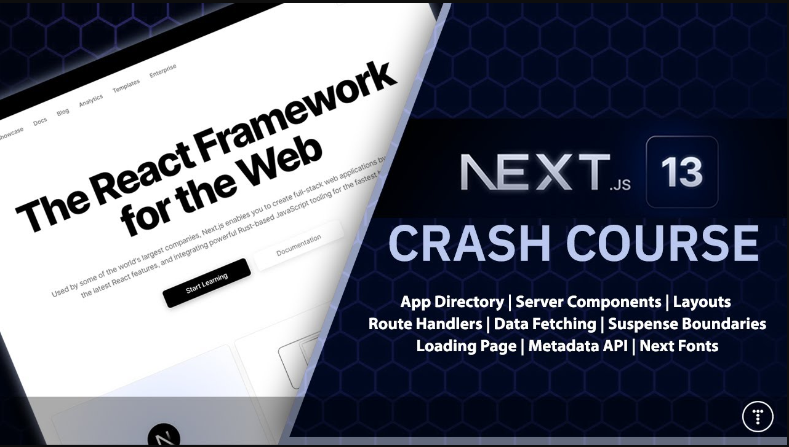

# Next.js 13 Crash Course | App Directory, React Server Components & More

https://www.youtube.com/watch?v=Y6KDk5iyrYE&ab_channel=TraversyMedia

> A complete crash course to NextJS version 13 and it's new features such as the app directory structure, routing, React Server Components vs client components, layouts and more.

Project --> **List from an API and list from DB**  
Channel --> **Traversy Media 2,15 mi de inscritos**  
Date Created --> **5 de abr. de 2023**

### Observations

-  created-with-next13js
-  react-icons
-  uuid
-  autoLoading page for RSC
-  Suspense component
-  api in nextjs
   -  route to searched courses

### Components

-  page.jsx (client)
   -  coursesSearch (server)
   -  courses (client)
-  loading.jsx (server)
   -  create/page (client)
   -  header (server)
   -  code
      -  ReposPage
         -  RepoPage[name] details
   -  about
      -  team
   -  api
      -  helloWorld
      -  courses
         -  search from url parameter

## Advantages of RSC (React ServerSide Components)

### By default in next.js components are created on serverSide unless you specify that they are client components

-  Load faster - Don't have to wait for the JavaScript to load
-  Smaller client bundle size
-  SEO friendly
-  Access to resources the client can't access
-  Hide sensitive data from the client
-  More secure against XSS attacks
-  Improved developer experience

### Just like with anything else, there are also disadvantages

-  Not as interactive
-  No component state. We can not use the `useState` hook.
-  No component lifecycle methods.
-  We can not use the `useEffect hook.

 
 

## Commits

### 1st commit

-  Routes
-  RSC
-  Suspense
-  Cache & revalidate

### 2nd commit

-  Params on URL
-  Client side component vs RSC

---

### Timestamps  
0:00 - Intro  
2:32 - Setup & File Structure 
5:22 - Homepage & Clean Up 
7:12 - Routing System  
10:02 - Nested Routes  
11:04 - Layouts  
13:37 - Metadata API  
15:31 - next/font/google  
19:10 - Header Component  
21:19 - React Server Components  
23:26 - use client  
24:13 - Data Fetching  
28:05 - ReposPage Output  
31:47 - Custom Loading Page  
34:16 - Dynamic Routes  
35:30 - params Prop  
37:07 - Repo & RepoDir Component  
45:57 - Suspense Boundaries  
48:29 - Caching & Revalidating  
51:30 - API Route Handlers   
53:49 - Serving Course Data  
56:00 - Fetching Course Data  
1:00:32 - Getting Search Params   
1:06:00 - Getting Body Data  
1:10:00 - Refactor Server to Client Component  
1:16:30 - Search Component  